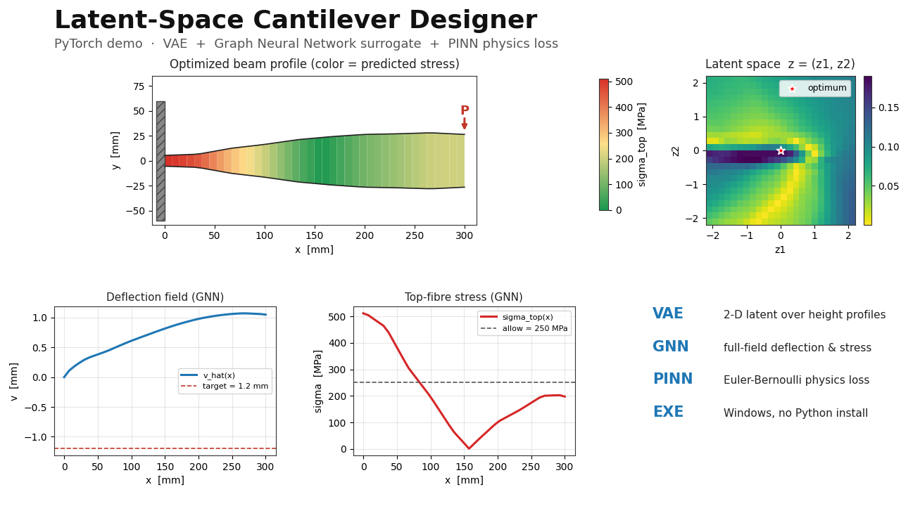

# NeuralBeam

**Latent-space cantilever designer — PyTorch VAE + Graph Neural Network + Physics-Informed loss.**

A small, self-contained demo that compresses 1-D cantilever beam profiles into a
2-D latent space, predicts deflection and stress fields with a GNN surrogate
trained against an Euler–Bernoulli FEA solver, and inverts the latent vector
with gradient descent to produce designs that hit a tip-deflection target
under an allowable-stress constraint.



> Looking for the trained model + interactive Windows viewer (no Python install
> required)? Grab the **$9 binary release on Gumroad** → **[NeuralBeam on Gumroad](https://deepakster722.gumroad.com/l/afutgn)**
> *(replace with your published product URL)*

---

## What this is

Three classical pieces wired into one tiny training loop:

| Component | Role |
|---|---|
| **VAE** (`13 → 2 → 13`) | Compresses a 10-control-point height profile + 3 feature scalars into a smooth 2-D latent. |
| **Chain-MP GNN** (4 layers, hidden 64) | Predicts per-node deflection `v(x)` and max-fibre stress `σ(x)` from the geometry graph. Drop-in replacement for the FEA solver. |
| **PINN residual** | Adds the discretised Euler–Bernoulli residual `M(x) − E·I(x)·v''(x)` to the GNN loss so predictions stay physically consistent off-distribution. |

Inverse design = freeze the trained nets, optimise `z ∈ R²` with Adam against
`(δ_tip − δ_target)² + λ·ReLU(σ_max − σ_allow)²`. Converges in ~50 seconds on
CPU.

## Why it exists

The full physics-informed-ML stack (generative model + GNN surrogate +
physics loss + inverse design) usually shows up across half a dozen papers
and three different repos. NeuralBeam is the **shortest end-to-end working
example I could write** — small enough to read in one sitting, complete
enough to actually run and demo.

## What's in this repo

```
neuralbeam/
├── README.md                  ← you are here
├── LICENSE                    ← MIT (this repo only — paid release is separate)
├── requirements.txt
├── docs/
│   └── cover.png              ← project hero image
└── notebooks/
    └── 01_euler_bernoulli_baseline.ipynb   ← classical FEA reference (no ML)
```

**This repo contains the classical baseline notebook and explanatory material.**
The trained PyTorch checkpoint, the full VAE+GNN+PINN training script, the
inverse-design optimiser, and the packaged Windows .exe live in the paid
Gumroad release.

## Quick concept walk-through

### 1. Geometry parameterisation

A cantilever of length `L = 300 mm` is described by 10 height control points
`h_i ∈ [8, 60] mm`. A cubic spline interpolates to 41 nodes along the span.

```
                   ┌──────── 300 mm ────────┐
        ╔════╗     ↓                        ↓
   wall ║    ╠════════════════════════════════
        ║    ╠═══════════════════════════ ────  ← height profile h(x)
        ║    ╠════════════════════════════════
        ╚════╝                              ↑ P (tip load)
```

### 2. VAE compression

```
   13-D shape vector  ─►  encoder ─►  μ, log σ²  ─►  z ∈ R²  ─►  decoder  ─►  reconstructed shape
```

The 2-D latent is small enough to scan visually (one heatmap covers the
whole design space) but expressive enough to recover smooth tapered beams,
constant-section beams, and stepped beams.

### 3. GNN surrogate

A 4-layer chain message-passing network, hidden width 64, predicts
`(v_i, σ_i)` at each node from `(x_i, h_i, h_i', h_i'')`. Trained against the
FEA solver in `cantilever_features.py`.

### 4. Physics residual

Per training batch:

```
L_total = L_recon(VAE) + β·KL(VAE) + L_supervised(GNN) + λ_phys · ‖M − E·I·v''‖²
```

The physics term keeps predictions valid for shapes the GNN never saw.

### 5. Inverse design

```python
z = torch.zeros(2, requires_grad=True)
opt = Adam([z], lr=0.05)
for _ in range(200):
    h = vae.decode(z)
    v, sigma = gnn(h)
    loss = (v[-1] - DELTA_TARGET).pow(2) + LAMBDA * F.relu(sigma.max() - SIGMA_ALLOW).pow(2)
    opt.zero_grad(); loss.backward(); opt.step()
```

Output: a beam profile that hits the target tip deflection without exceeding
allowable stress, in one second of CPU.

## Running the classical baseline

```bash
pip install -r requirements.txt
jupyter notebook notebooks/01_euler_bernoulli_baseline.ipynb
```

Walks through the analytical and FEA solution for a tapered cantilever
end-to-end, with plots of the height profile, deflection curve, and stress
curve. This is the ground-truth solver the ML surrogate in the paid release is
trained against.

## The paid release

The **$9 Gumroad release** adds:

- `cantilever_hybrid.py` — full VAE + GNN + PINN training + interactive viewer
- `cantilever_hybrid.pt` — pre-trained checkpoint (no GPU needed)
- `cantilever_hybrid.exe` — one-folder Windows build (~700 MB unzipped, runs in ~20 s)
- An interactive matplotlib viewer where you drag `(z₁, z₂)` and watch the
  beam silhouette + deflection + stress update in real time, with the FEA
  solver running side-by-side for comparison
- README, license, third-party notices

**[Get it on Gumroad — $9](https://deepakster722.gumroad.com/l/afutgn)** *(replace with your URL)*

## Who this is for

- **Engineering students** wanting a complete worked example of VAE + GNN + PINN
  on a problem they can hand-verify against beam theory.
- **ML engineers** curious about physics-informed losses without wading through
  PDE-heavy papers.
- **Anyone teaching generative design / surrogate modelling** who needs a
  classroom-sized demo that fits in a single repo.

## Not for

- Production structural analysis. This is a 1-D Euler–Bernoulli toy. Real
  beams need 2-D/3-D FEA.
- Anyone who already has the full physics-informed-ML stack working — you
  won't learn anything new here.

## License

MIT for everything in this repo. The paid Gumroad release ships under a
separate single-seat commercial license — see `LICENSE.txt` inside that
bundle.

## Author

Built by Deepak K · *([your GitHub / site])*
